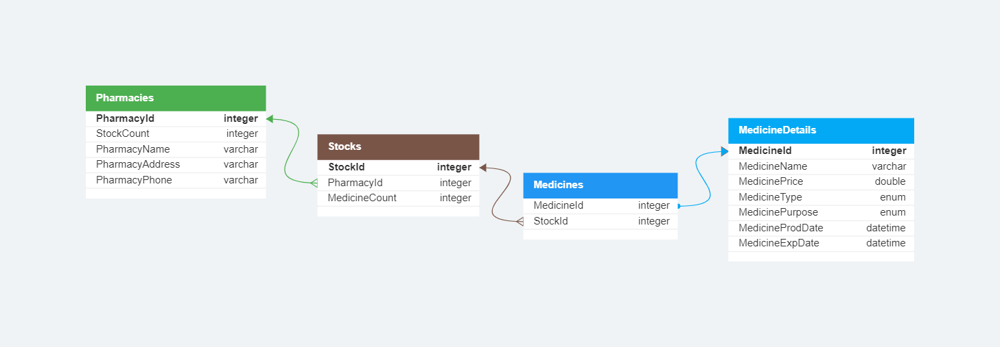

<h1 style="text-align:center">Aptek proyekti</h1>

Bu proyektdə aptek idarə sistemi hazırlanmalıdı. Sistemdə dərmanların əlavə edilməsi, hazırki dərmanların siyahı şəklində göstərilməsi kimi funksiyalar olacaq(ətraflı aşağıda). Sistemə əlavə olan dərmanlar database-də saxlanılmalıdır və beləcə dərmanların daha effektiv şəkildə idarəsi təmin olunmalıdır. Sistem isə konsol applikasiyası kimi yazılmalıdır.

## Proyektdə olacaq özəlliklər(istəyə bağlı artırıla bilər)

- **Bir menyu hansı ki, istifadəçilər seçimlərə görə funksionallıqlardan istifadə edirlər**
- **Menyuya aid olan bölmələr**:

  - Hazırki, olan rəflərə göz atmaq(həmin rəflərdəki dərmanları və qiymətlərini görmək)
  - Dərman axtarmaq. Bunda isə müxtəlif özəlliklərinə görə axtarmaq mümkün olmalıdır(məsələn adına, qiymətinə və ya dərmanın istifadə məqsədinə görə)
  - Dərman əlavə etmək(yeni gələn dərmanların sistemə əlavə ediləcəyi bölmə)
  - Dərman satmaq(gələn müştəri üçün seçilən dərmanın satılmasıdır)
  - Dərmanı və ya rəfi update etmək

- **Database üçün ADO.NET seçilməlidir(SQL-i xatırlamaq üçün 🤠)**
- **Database üçün nümunə model:**
  
- **Mümkün qədər bütün ola biləcək exceptionlar nəzərə alınmalıdır və ehtiyyac olarsa Custom Exceptionlar yazılmalıdır**
